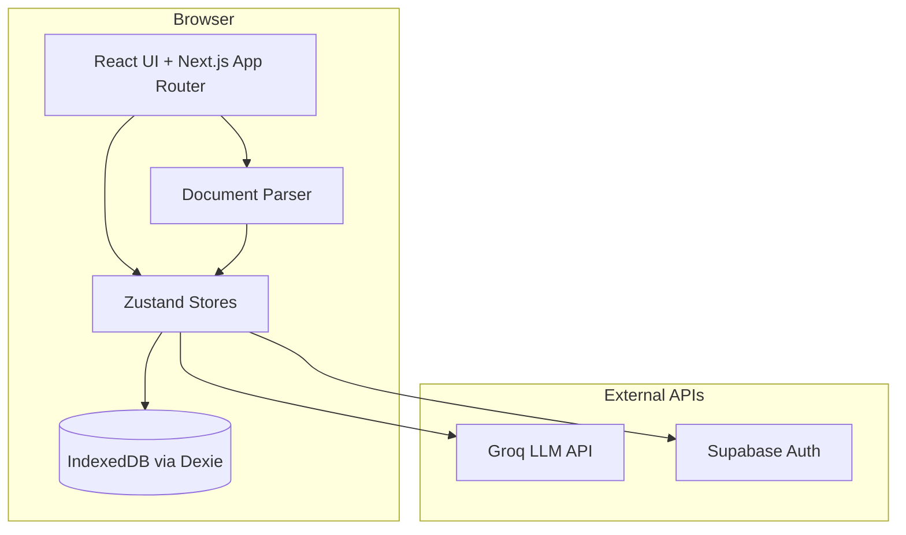
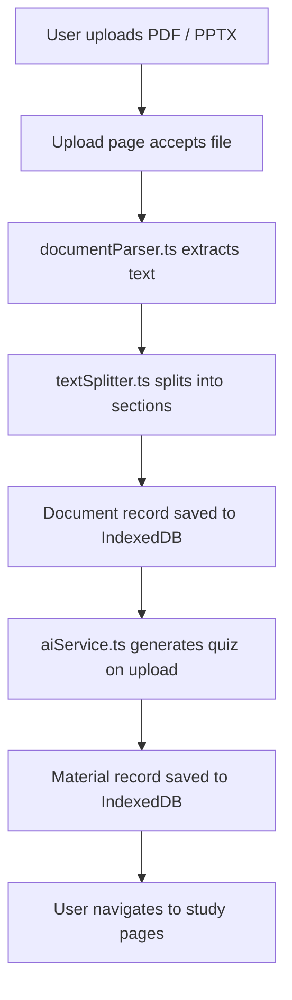
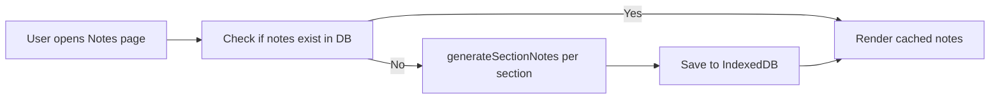
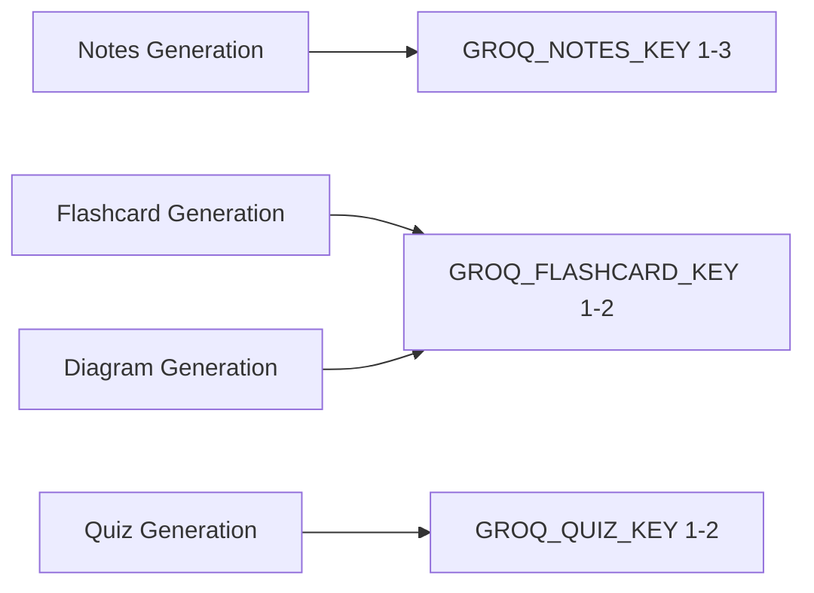

# Architecture

> Last updated: May 2026

This document describes the system design of ExamHelper AI — how the application is structured, how data flows through it, and how to extend it safely.

## Table of Contents

- [System Overview](#system-overview)
- [Runtime Modes](#runtime-modes)
- [Route Map](#route-map)
- [Data Flow](#data-flow)
- [Module Reference](#module-reference)
- [Database Schema](#database-schema)
- [AI Pipeline](#ai-pipeline)
- [Error Handling](#error-handling)
- [Extension Guide](#extension-guide)
- [Performance Considerations](#performance-considerations)

---

## System Overview

ExamHelper AI is a **client-heavy** Next.js application. The browser handles nearly all computation:

- **Routing and rendering** — Next.js App Router with React 18
- **State management** — Zustand stores for auth, courses, documents, and materials
- **Persistence** — IndexedDB via Dexie (all study data lives in the browser)
- **AI generation** — Browser-side API calls to Groq (GPT-OSS 20B)
- **Authentication** — Optional Supabase auth with demo-user fallback

There is no custom backend server. The app communicates directly with third-party APIs from the client.

---

## Runtime Modes

The application supports two runtime modes, determined automatically at startup based on the presence of environment variables.

### Demo Mode

Activated when Groq API keys and/or Supabase credentials are missing.

| Aspect | Behavior |
|---|---|
| Authentication | Auto-logs in a hardcoded demo user |
| AI generation | Returns deterministic sample materials |
| Storage | Local IndexedDB only |

### Configured Mode

Activated when at least one set of API keys is present in `.env.local`.

| Aspect | Behavior |
|---|---|
| Authentication | Supabase session-backed auth (email + password) |
| AI generation | Groq GPT-OSS 20B with key-pool rotation |
| Storage | Local IndexedDB (same as demo mode) |

> **Note:** Even in configured mode, all study data is stored locally. Supabase is used only for authentication, not data persistence.

---

## Route Map

Defined via the Next.js App Router in `src/app/`.

### Public Routes

| Path | Page Component | Description |
|---|---|---|
| `/` | `Landing.tsx` | Marketing landing page |
| `/login` | `Login.tsx` | Sign-in form |
| `/register` | `Register.tsx` | Account creation form |

### Protected Routes (under `/app`)

All routes under `/app` are wrapped by `src/app/app/layout.tsx`, which enforces authentication and renders the sidebar layout.

| Path | Page Component | Description |
|---|---|---|
| `/app` | `Dashboard.tsx` | Overview with stats and recent activity |
| `/app/courses` | `Courses.tsx` | Course list with create/delete |
| `/app/courses/:courseId` | `CourseDetail.tsx` | Course detail with tabs (documents, materials, progress) |
| `/app/upload` | `Upload.tsx` | File upload and processing |
| `/app/notes/:materialId` | `Notes.tsx` | Section-by-section note viewer |
| `/app/flashcards/:materialId` | `Flashcards.tsx` | Flashcard study with spaced repetition |
| `/app/quiz/:materialId` | `Quiz.tsx` | Quiz mode with scoring |
| `/app/exam/:materialId` | `ExamMode.tsx` | Timed exam simulation |
| `/app/diagrams/:materialId` | `Diagrams.tsx` | Mermaid diagram viewer |

---

## Data Flow

### Upload → Generation Pipeline

### On-Demand Generation

Notes, flashcards, and diagrams are **not** generated at upload time. They are generated on-demand when the user first navigates to the corresponding study page:

---

## Module Reference

### UI Layer

| Module | Location | Purpose |
|---|---|---|
| Page components | `src/pages/*.tsx` | Full-page views rendered by routes |
| Layout shell | `src/components/layout/Layout.tsx` | Sidebar + header wrapper for protected routes |
| UI primitives | `src/components/ui/*.tsx` | Reusable components (Button, Card, Dialog, etc.) |
| Toaster provider | `src/components/providers/ToasterProvider.tsx` | Toast notification renderer |

### State Layer

| Store | Location | Purpose |
|---|---|---|
| `useAuthStore` | `src/stores/authStore.ts` | User session, login/register/logout, demo fallback |
| `useCourseStore` | `src/stores/courseStore.ts` | CRUD operations for courses |
| `useDocumentStore` | `src/stores/documentStore.ts` | CRUD operations for uploaded documents |
| `useMaterialStore` | `src/stores/materialStore.ts` | CRUD operations for generated materials |

### Data Layer

| Module | Location | Purpose |
|---|---|---|
| Database | `src/lib/db.ts` | Dexie schema, table definitions, version migrations |
| Supabase client | `src/lib/supabase.ts` | Client initialization, mode detection, diagnostic logging |
| Weak area tracker | `src/lib/weakAreaTracker.ts` | Topic extraction from quiz questions, per-topic performance upserts |

### AI Layer

| Module | Location | Purpose |
|---|---|---|
| AI service | `src/lib/ai/aiService.ts` | Key pool management, Groq API calls, JSON extraction, demo fallback |
| Prompt templates | `src/lib/ai/prompts.ts` | Prompt builders for notes, flashcards, quiz, and diagram generation |

### Parsing Layer

| Module | Location | Purpose |
|---|---|---|
| Document parser | `src/lib/parsers/documentParser.ts` | PDF extraction (PDF.js) and PPTX extraction (JSZip + XML regex) |
| Text splitter | `src/lib/parsers/textSplitter.ts` | Splits extracted text into sections using page/slide markers |

### Algorithm Layer

| Module | Location | Purpose |
|---|---|---|
| Spaced repetition | `src/lib/generators/spacedRepetition.ts` | SM-2 algorithm for flashcard review scheduling |

---

## Database Schema

Managed by Dexie (IndexedDB) in `src/lib/db.ts`. Currently at schema version 3.

| Table | Key Fields | Purpose |
|---|---|---|
| `courses` | `id`, `courseCode`, `courseName`, `semester` | Course metadata |
| `documents` | `id`, `courseId`, `filename`, `extractedText`, `sections` | Uploaded files and extracted content |
| `materials` | `id`, `documentId`, `type`, `content` | Generated study materials (notes, quiz, flashcards, diagrams) |
| `flashcards` | `id`, `materialId`, `front`, `back`, `nextReview`, `easeFactor` | Individual flashcards with SRS fields |
| `quizAttempts` | `id`, `materialId`, `score`, `answers`, `durationSeconds` | Quiz/exam attempt history |
| `studySessions` | `id`, `date`, `duration`, `cardsReviewed` | Study session logs |
| `weakAreas` | `id`, `courseId`, `topic`, `wrongCount`, `totalAttempts` | Per-topic performance tracking |

### Version History

| Version | Change |
|---|---|
| v1 | Initial schema (courses, documents, materials, flashcards, quizAttempts, studySessions) |
| v2 | Added `sections` field to `documents` for section-by-section note generation |
| v3 | Added `weakAreas` table for per-topic quiz performance tracking |
| v4 | Added compound index `[courseId+topic]` to `weakAreas` table |

---

## AI Pipeline

### Key Pool Architecture

The AI service uses **task-isolated Groq API key pools** to prevent rate limiting on one task from blocking another:

Each pool supports automatic key rotation: if a key hits a 429 rate limit, the next key in the pool is tried before failing.

### Generation Functions

| Function | Input | Output | Called From |
|---|---|---|---|
| `generateStudyMaterials()` | Full document text | Quiz material | Upload page |
| `generateSectionNotes()` | Single section text | Markdown notes | Notes page |
| `generateFlashcardsOnly()` | Full document text | 30 flashcards | Flashcards page |
| `generateMoreFlashcards()` | Text + previous fronts | 30 new flashcards | Flashcards page |
| `generateDiagramMaterial()` | Full document text | Mermaid code | Diagrams page |
| `generateMoreQuizQuestions()` | Text + previous Qs | 15 new questions | Quiz page |
| `generateWeakAreaQuiz()` | Text + weak topics | 15 targeted questions | Course detail |

### JSON Extraction

All AI responses pass through `extractJSON()`, a resilient parser that handles:
- Direct JSON strings
- JSON wrapped in markdown code blocks
- Trailing commas and smart quotes
- Partial JSON objects extracted via regex

---

## Error Handling

| Layer | Strategy |
|---|---|
| **Zustand stores** | Async methods catch errors, set `error` state, and return `{ success, error }` payloads |
| **Upload pipeline** | Text extraction and AI generation wrapped in `try/catch`; failures surface via toast notifications |
| **AI service** | Key rotation on 429s; graceful fallback to demo content when all keys are exhausted |
| **JSON parsing** | Multi-stage extraction (direct parse → code block → regex) with error logging at each stage |
| **Auth** | 15-second timeout on Supabase calls to prevent indefinite hangs |

---

## Extension Guide

### Adding a New Material Type

1. Add a generation function in `src/lib/ai/aiService.ts`
2. Add a prompt template in `src/lib/ai/prompts.ts` (if needed)
3. Create a page component in `src/pages/`
4. Add a route in `src/app/app/`
5. Update `CourseDetail.tsx` to link to the new material
6. Update the `materials` table type discriminator if needed

### Supporting a New File Format

1. Add an extraction function in `src/lib/parsers/documentParser.ts`
2. Update the `extractText()` dispatcher to handle the new extension
3. Update the `Upload.tsx` file input `accept` attribute

### Swapping the AI Provider

1. Add provider initialization in `src/lib/ai/aiService.ts`
2. Replace or supplement `groqGenerate()` with the new provider's call
3. Preserve the output contract (JSON shape) for each material type
4. Keep `buildDemoMaterials()` and `generateDemoContent()` intact for keyless development

---

## Performance Considerations

- **Input truncation** — AI generation input is truncated (default 4,000 chars) to stay within Groq free-tier token limits
- **Rate limiting** — A 1-second cooldown is applied between section note generations to avoid hitting Groq TPM limits
- **Client-side parsing** — PDF.js and JSZip run on the main thread; very large files (80+ slides) may cause UI jank. Consider the [offline Python script](../scripts/README.md) for heavy preprocessing
- **IndexedDB limits** — Browsers typically allow 50–100 MB per origin. Extracted text from large documents can consume significant storage
