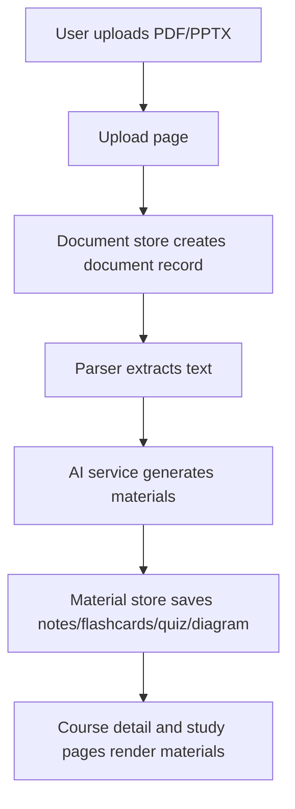

# Architecture

This document explains how ExamHelper AI is structured, how data flows through the app, and where to extend it safely.

## System Summary

ExamHelper AI is a client-heavy web app:
- UI and routing in React
- State and side effects in Zustand stores
- Persistence in IndexedDB via Dexie
- Optional Supabase authentication
- AI content generation through browser-side API calls

## Runtime Modes

### 1. Demo mode

Enabled when Supabase and/or AI keys are missing.

- Auth: auto-logs in a demo user
- AI generation: returns deterministic sample materials
- Storage: local IndexedDB only

### 2. Configured mode

Enabled when env keys are provided.

- Auth: Supabase session-backed auth
- AI generation: Gemini first, Groq fallback
- Storage: still local IndexedDB for course/doc/material data

## App Route Map

Defined in src/App.jsx:

- Public routes:
  - /
  - /login
  - /register
- Protected routes under /app:
  - /app (dashboard)
  - /app/courses
  - /app/courses/:courseId
  - /app/upload
  - /app/notes/:materialId
  - /app/flashcards/:materialId
  - /app/quiz/:materialId
  - /app/diagrams/:materialId

## Data Flow

## Core Modules

### UI layer

- src/pages: Route-level pages
- src/components: Reusable and feature-specific components
- src/components/layout/Layout.jsx: Main protected shell

### State layer

- src/stores/authStore.js
  - User session state
  - Demo-mode fallback logic
- src/stores/courseStore.js
  - CRUD for courses
- src/stores/documentStore.js
  - CRUD for documents
- src/stores/materialStore.js
  - CRUD for generated materials

### Data layer

- src/lib/db.js
  - Dexie schema and local database initialization
- src/lib/supabase.js
  - Supabase client creation and mode detection

### AI layer

- src/lib/ai/aiService.js
  - Provider initialization
  - Fallback strategy (Gemini -> Groq -> demo content)
  - JSON extraction/repair helper for model output
- src/lib/ai/prompts.js
  - Prompt templates for material generation

### Parsing layer

- src/lib/parsers/documentParser.js
  - PDF extraction via PDF.js
  - PPTX extraction via JSZip + XML parsing

## IndexedDB Schema

Configured in src/lib/db.js:

- courses
- documents
- materials
- flashcards
- quizAttempts
- studySessions

All user-generated study content is persisted locally in this schema.

## Error Handling Strategy

- Store-level async functions return success/error payloads.
- Upload pipeline wraps extraction and generation in try/catch.
- AI responses are parsed through a resilient JSON extraction function.
- UI uses toast notifications for user-facing errors.

## Extension Points

### Add a new material type

1. Update AI generation logic in src/lib/ai/aiService.js.
2. Add storage handling in relevant store if needed.
3. Add a dedicated route/page in src/pages.
4. Register route in src/App.jsx.
5. Surface entry points in course detail or dashboard UI.

### Change parser support

1. Extend file type detection in src/lib/parsers/documentParser.js.
2. Add extraction function for the new format.
3. Update Upload page file filter and accepted extensions.

### Swap AI provider strategy

1. Update provider initialization in src/lib/ai/aiService.js.
2. Preserve output contract (notes/flashcards/quiz/diagram JSON shape).
3. Keep demo-mode generation intact for no-key development.

## Performance Notes

- Generation input is truncated before provider calls to stay inside token limits.
- Parsing and generation happen in the browser, so large files can impact UI responsiveness.
- Consider web workers for heavy parsing/generation if scaling this app further.
