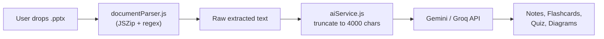

# PowerPoint Text Extraction Pipeline — Implementation Plan

## Problem Statement

The ExamHelper AI app currently parses PPTX files **in the browser** using JSZip + XML regex matching ([documentParser.js](file:///d:/AI%20Project/src/lib/parsers/documentParser.js#L44-L99)). This approach has two critical bottlenecks when dealing with massive 80+ slide presentations:

1. **Browser performance** — Parsing huge ZIP archives client-side blocks the UI thread (noted in [ARCHITECTURE.md](file:///d:/AI%20Project/docs/ARCHITECTURE.md#L149): *"Parsing and generation happen in the browser, so large files can impact UI responsiveness"*).
2. **Brutal text truncation** — In [aiService.js](file:///d:/AI%20Project/src/lib/ai/aiService.js#L173), extracted text is hard-truncated to **4,000 characters** before being sent to the LLM. For an 80-slide deck, this means the AI only ever sees ~5-10% of the content. All downstream materials (notes, flashcards, quizzes, diagrams) are therefore generated from a tiny fraction of the source material.

The goal is to build a **standalone Python pre-processing script** that extracts, sanitizes, and exports all text from one or more large PPTX files — producing a clean `master_extracted_text.txt` ready to be chunked and fed into the LLM pipeline without exceeding token limits.

---

## Current Architecture Snapshot



> [!WARNING]
> **Step D is the bottleneck.** The `truncatedText = text.slice(0, 4000)` line in `generateStudyMaterials()` silently discards the vast majority of content from large presentations. Any improvement to extraction is wasted unless we also address how the text reaches the LLM.

---

## Proposed Changes

### Overview

Add a `scripts/` directory at the project root containing the Python extraction script and a companion README. The script is **not** part of the React/Vite frontend — it runs independently as a CLI pre-processing step.

```text
d:\AI Project\
├── scripts/
│   ├── extract_pptx.py        [NEW]  ← The extraction script
│   ├── requirements.txt       [NEW]  ← python-pptx dependency
│   └── README.md              [NEW]  ← Usage instructions
├── src/
│   └── lib/
│       └── ai/
│           └── aiService.js   [MODIFY] ← Chunking strategy (optional Phase 2)
└── ...
```

---

### Phase 1 — Python Extraction Script

#### [NEW] `scripts/extract_pptx.py`

A single, concise, comment-free Python script that does exactly the following:

| Step | What it Does |
|------|-------------|
| **1. File Discovery** | Scans a target directory (passed as CLI arg or defaulting to `./`) for all `*.pptx` files using `pathlib.Path.glob()`. |
| **2. Extraction Loop** | Opens each `.pptx` with `python-pptx`, iterates every slide, and scans every shape on the slide. |
| **3. Text Targeting** | For each shape, checks `shape.has_text_frame`. If true, iterates `shape.text_frame.paragraphs` → `paragraph.runs` → `run.text`. This captures titles, body text boxes, bulleted lists, and sub-bullets that the current regex approach (`<a:t>...</a:t>`) can miss. |
| **4. Sanitization** | Applies: `re.sub(r'\s+', ' ', text).strip()` per paragraph + filters out fully empty lines. This eliminates excessive whitespace, trailing spaces, and blank-space pollution. |
| **5. Aggregation** | Concatenates all extracted text across all slides and all files into a single string, with `--- Slide N ---` and `=== File: name.pptx ===` delimiters for structure. |
| **6. Export** | Writes the final mega-string to `master_extracted_text.txt` in the **same target directory**. |
| **7. Resilience** | Wraps each file open and each shape access in `try/except` blocks. Corrupted files or unreadable shapes print a warning to stderr and are skipped; the loop never crashes. |

**Pseudocode flow:**

```
import sys, re, pathlib
from pptx import Presentation

target_dir = sys.argv[1] if len(sys.argv) > 1 else "."
pptx_files = sorted(pathlib.Path(target_dir).glob("*.pptx"))
mega_text = ""

for file_path in pptx_files:
    try:
        prs = Presentation(str(file_path))
    except:
        print(f"Skipping corrupted: {file_path}", file=stderr)
        continue

    for slide_num, slide in enumerate(prs.slides, 1):
        slide_text = ""
        for shape in slide.shapes:
            try:
                if shape.has_text_frame:
                    for para in shape.text_frame.paragraphs:
                        line = " ".join(run.text for run in para.runs)
                        line = re.sub(r'\s+', ' ', line).strip()
                        if line:
                            slide_text += line + "\n"
            except:
                continue
        if slide_text.strip():
            mega_text += f"\n--- Slide {slide_num} ---\n{slide_text}"

    mega_text = f"=== {file_path.name} ===\n{mega_text}\n"

output_path = pathlib.Path(target_dir) / "master_extracted_text.txt"
output_path.write_text(mega_text.strip(), encoding="utf-8")
print(f"Saved to {output_path} ({len(mega_text)} chars)")
```

> [!IMPORTANT]
> **No comments in the final script.** The user explicitly requested raw, functional code with zero `#` comments or docstrings. The pseudocode above is for planning only.

#### [NEW] `scripts/requirements.txt`

```
python-pptx
```

Single dependency. No other packages needed.

#### [NEW] `scripts/README.md`

Brief usage doc:
- Prerequisites: Python 3.8+
- Install: `pip install -r requirements.txt`
- Run: `python extract_pptx.py "D:\path\to\pptx\folder"`
- Output: `master_extracted_text.txt` in the target folder

---

### Phase 2 (Optional) — LLM Chunking Integration

> [!NOTE]
> Phase 2 is optional and addresses the **real** problem: even with perfect extraction, the 4000-char truncation in `aiService.js` wastes most of the content. This phase proposes a chunking strategy so the LLM processes the *entire* extracted text.

#### [MODIFY] [aiService.js](file:///d:/AI%20Project/src/lib/ai/aiService.js)

**Current problem (line 173):**
```javascript
const truncatedText = text.slice(0, 4000)  // ← kills 90%+ of large file content
```

**Proposed strategy — Sliding-window chunking:**

| Approach | How it Works | Tradeoff |
|----------|-------------|----------|
| **A. Map-Reduce** | Split text into ~3500-char chunks with 200-char overlap. Send each chunk to the LLM independently. Merge/deduplicate the JSON outputs. | Best coverage, most API calls |
| **B. Smart Summarize-then-Generate** | First pass: summarize each chunk into ~500 chars. Second pass: feed all summaries as one prompt to generate materials. | Fewer API calls, lossy |
| **C. Increase truncation limit** | Simply raise the `4000` to `30000` for Gemini (which supports 1M tokens). Keep Groq fallback at `3000`. | Easiest change, may hit Groq limits |

**Recommended: Option C as a quick win, Option A as the robust long-term solution.**

For Option C, the change is minimal:
```diff
- const truncatedText = text.slice(0, 4000)
+ const maxChars = genAI ? 30000 : 3000
+ const truncatedText = text.slice(0, maxChars)
```

This alone would let Gemini (which has a 1M token context window) see ~7x more content from large presentations.

---

## Why python-pptx Instead of the Current JSZip Approach

| Aspect | Current (JSZip + regex) | Proposed (python-pptx) |
|--------|------------------------|----------------------|
| Text capture | Regex `<a:t>...</a:t>` only | Full shape → text_frame → paragraph → run traversal |
| Grouped text shapes | Misses grouped/nested shapes | Handles grouped shapes via `shape.has_text_frame` |
| Table text | ❌ Missed entirely | ✅ Tables have text_frames per cell |
| SmartArt | ❌ Missed | Partially captured |
| Speaker notes | ✅ Captured separately | Can add if needed |
| Runs in browser | Yes (client-side) | No (offline CLI step) |
| Performance on 80+ slides | Slow, blocks UI | Fast, runs in terminal |

---

## File Structure After Implementation

```text
d:\AI Project\
├── scripts/                          [NEW DIRECTORY]
│   ├── extract_pptx.py              [NEW] — Main extraction script
│   ├── requirements.txt             [NEW] — python-pptx
│   └── README.md                    [NEW] — Usage guide
├── src/lib/ai/aiService.js          [MODIFY, Phase 2] — Chunking fix
└── (everything else unchanged)
```

---

## User Review Required

> [!IMPORTANT]
> **Phase scope:** Should I implement only Phase 1 (the Python script alone), or also Phase 2 (the `aiService.js` chunking fix to actually use more of the extracted text in the LLM pipeline)?

> [!IMPORTANT]
> **Script output location:** The plan saves `master_extracted_text.txt` in the same directory as the `.pptx` files. Would you prefer a different output location (e.g., always `d:\AI Project\scripts\output\`)?

> [!IMPORTANT]
> **Speaker notes:** The current browser parser extracts speaker notes from PPTX. Should the Python script also extract speaker notes, or only slide content?

---

## Open Questions

1. **Where are your PPTX files stored?** The script needs a target directory path. Is there a standard folder you use, or should it accept any path as a CLI argument?

2. **Do you plan to paste `master_extracted_text.txt` content manually into the app**, or do you want a mechanism (e.g., file upload of `.txt`, or a Node.js wrapper) to feed it back into the existing React pipeline automatically?

3. **Multiple files vs. single file:** You mentioned "massive PowerPoint files (80+ slides)" — is this typically one file at a time, or a batch of many files? This affects whether the `=== File: name.pptx ===` delimiters are useful.

---

## Verification Plan

### Automated Tests
1. Run the script against a test directory with:
   - A normal `.pptx` (5-10 slides) — verify all text extracted
   - A large `.pptx` (80+ slides) — verify performance and completeness
   - A corrupted/non-pptx file renamed to `.pptx` — verify graceful skip
   - An empty directory — verify clean exit with message
2. Verify `master_extracted_text.txt` exists and contains expected `--- Slide N ---` delimiters
3. Verify no excessive whitespace or empty lines in output

### Manual Verification
1. Compare output text against manually reading a few slides to confirm no content is missed
2. Spot-check that tables and bulleted lists are properly captured
3. If Phase 2 is approved, verify the app generates materials from more than the first 4000 chars
